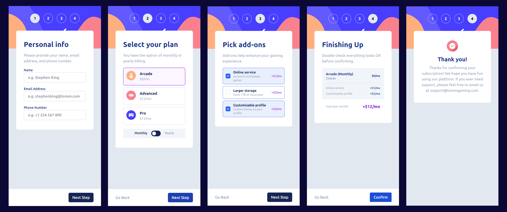

# Frontend Mentor - Multi-step form solution

This is a solution to the [Multi-step form challenge on Frontend Mentor](https://www.frontendmentor.io/challenges/multistep-form-YVAnSdqQBJ). Frontend Mentor challenges help you improve your coding skills by building realistic projects. 

## Table of contents

- [Overview](#overview)
  - [The challenge](#the-challenge)
  - [Screenshot](#screenshot)
  - [Links](#links)
- [My process](#my-process)
  - [Built with](#built-with)
  - [What I learned](#what-i-learned)
- [Author](#author)

## Overview

### The challenge

Users should be able to:

- Complete each step of the sequence
- Go back to a previous step to update their selections
- See a summary of their selections on the final step and confirm their order
- View the optimal layout for the interface depending on their device's screen size
- See hover and focus states for all interactive elements on the page
- Receive form validation messages if:
  - A field has been missed
  - The email address is not formatted correctly
  - A step is submitted, but no selection has been made

### Screenshot
- Desktop

- Mobile

### Links

- Repo URL: [click here](https://github.com/fiqihalfito/Multi-step-form-solution)
- Live Site URL: [click here](https://multi-step-form-solution-chi.vercel.app/)

## My process

### Built with

- Semantic HTML5 markup
- Flexbox
- CSS Grid
- Mobile-first workflow
- [React](https://reactjs.org/) - JS library
- [Next.js](https://nextjs.org/) - React framework
- [Tailwind](https://tailwindcss.com/) - For styles

### What I learned

improve my useState (React Hook) skill to change pages (steps)

## Author

- Github - [fiqihalfito](https://www.github.com/fiqihalfito)
- Instagram - [@fiqihalfito](https://www.instagram.com/fiqihalfito)
- LinkedIn - [fiqih-alfito](https://www.linkedin.com/in/fiqih-alfito)
